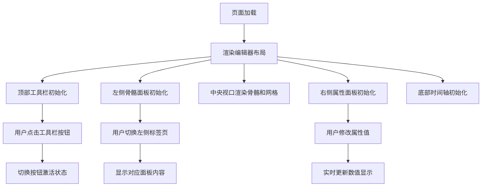

## 1. 产品概述
骨骼动画编辑器 Web 交互预览版 — 将 Android 原生编辑器界面以 Web 形式完整复刻，提供所见即所得的 UI 预览体验，消除原生开发中的"黑盒效应"，让开发者在不启动 Android 模拟器/真机的情况下即可预览和验证编辑器界面的布局、交互和视觉效果。

- 目标用户：Glimmerseed 项目开发者
- 核心价值：即时预览编辑器 UI，加速 UI 调试和设计迭代

## 2. 核心功能

### 2.1 功能模块
1. **顶部工具栏**：文件操作（新建/打开/保存）、编辑操作（撤销/重做）、操纵器模式切换（平移/旋转/缩放）、视图开关（网格/洋葱皮）、播放控制（播放/暂停）、悬浮窗切换（开启预览/关闭预览）、设置按钮、状态显示（FPS/时间/选中骨骼/关键帧数）
2. **左侧面板**：标签页切换（骨骼树/资源/动画剪辑），骨骼层级树展示，底部操作按钮（添加骨骼/删除骨骼/导入纹理/新建动画）
3. **中央视口**：深色背景画布，网格线显示，骨骼结构渲染，坐标轴指示
4. **右侧属性面板**：选中骨骼信息展示，位置/旋转/缩放属性编辑，骨骼名称和父级信息
5. **底部时间轴**：时间标尺（文件夹式分段），播放头指示器，多条关键帧轨道，关键帧菱形/圆形标记

### 2.2 页面详情
| 页面名称 | 模块名称 | 功能描述 |
|---------|---------|---------|
| 编辑器主页 | 顶部工具栏 | 多组工具按钮，含文件、编辑、操纵器、视图、播放、悬浮窗控制及状态信息显示 |
| 编辑器主页 | 左侧面板 | 三标签页（骨骼树/资源/动画剪辑），骨骼树支持层级展开，底部含操作按钮 |
| 编辑器主页 | 中央视口 | Canvas 画布，支持网格显示、骨骼线条渲染、洋葱皮预览效果 |
| 编辑器主页 | 右侧属性面板 | 显示选中骨骼的名称、父级、位置(X/Y)、旋转角度，含数字输入框 |
| 编辑器主页 | 底部时间轴 | 时间标尺刻度线、播放头、多条关键帧轨道带关键帧标记点和连接线 |

## 3. 核心流程

## 4. 用户界面设计

### 4.1 设计风格
- **主题**：深色工业风（Dark Industrial），还原 Android 编辑器原貌
- **主色调**：背景深灰 #1A1A2E，面板 #1E1E2E，高亮紫 #6200EE
- **辅助色**：文字 #CCCCCC，骨骼线 #4CAF50，关键帧 #FF5252，选中 #FFEB3B
- **字体**：系统等宽/无衬线字体，工具栏 10px/12px 小字，面板标题 14px
- **布局**：顶部工具栏 + 三栏（左面板/中央视口/右面板）+ 底部时间轴
- **圆角**：按钮 8px，面板卡片 12px
- **间距**：紧凑型布局，组件间距 8dp（映射为 8px）

### 4.2 页面设计概览
| 页面名称 | 模块名称 | UI 元素 |
|---------|---------|--------|
| 编辑器主页 | 顶部工具栏 | 深色背景，按钮组用分隔线隔开，激活态紫色背景，图标+文字纵向排列 |
| 编辑器主页 | 左侧面板 | TabRow 标签栏，骨骼树用缩进+折叠箭头，底部操作按钮组 |
| 编辑器主页 | 中央视口 | 深蓝黑画布，半透明网格线，绿色骨骼连线，白色关节圆点，左上角坐标轴 |
| 编辑器主页 | 右侧属性面板 | 分组卡片式布局，属性标签+数值输入框，灰色分隔线 |
| 编辑器主页 | 底部时间轴 | 深黑背景，渐变时间标尺，红色播放头，多条轨道各带彩色关键帧标记 |

### 4.3 响应式设计
- 桌面优先，最小宽度 1280px
- 固定布局，不进行移动端适配