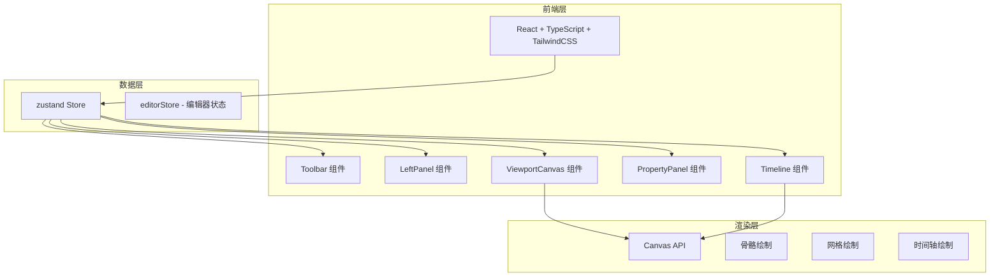

## 1. 架构设计


## 2. 技术描述
- 前端：React@18 + TypeScript + TailwindCSS@3 + Vite
- 初始化工具：vite-init（react-ts 模板）
- 状态管理：zustand
- UI 库：lucide-react（图标）
- 后端：无（纯前端静态页面）
- 数据：全部使用硬编码模拟数据

## 3. 路由定义
| 路由 | 用途 |
|-----|------|
| / | 编辑器主页（唯一页面） |

## 4. 组件树
```
App
├── EditorLayout
│   ├── TopToolbar
│   │   ├── ToolbarButton (×N)
│   │   ├── Divider (×N)
│   │   └── StatusDisplay
│   ├── EditorBody
│   │   ├── LeftPanel
│   │   │   ├── TabRow
│   │   │   ├── BoneTreePanel
│   │   │   ├── ResourcePanel
│   │   │   ├── AnimationClipsPanel
│   │   │   └── PanelActions
│   │   ├── ViewportCanvas
│   │   │   ├── GridLayer
│   │   │   ├── AxisIndicator
│   │   │   ├── SkeletonRenderer
│   │   │   └── OnionSkinPreview
│   │   └── RightPanel
│   │       ├── BoneInfoCard
│   │       ├── PositionEditor
│   │       ├── RotationEditor
│   │       └── ScaleEditor
│   └── BottomTimeline
│       ├── TimeRuler
│       ├── Playhead
│       └── KeyframeTrack (×3)
```

## 5. 数据模型
```typescript
interface Bone {
  id: number;
  name: string;
  parentId: number | null;
  x: number;
  y: number;
  rotation: number;
  length: number;
  children: Bone[];
}

interface Keyframe {
  time: number;
  type: 'normal' | 'linear' | 'bezier' | 'step';
  selected: boolean;
}

interface EditorState {
  selectedBoneId: number | null;
  showGrid: boolean;
  onionSkinEnabled: boolean;
  isPlaying: boolean;
  manipulatorMode: 'translate' | 'rotate' | 'scale';
  skeleton: Bone[];
  keyframeTracks: Keyframe[][];
}

// 存储结构
interface EditorStore extends EditorState {
  toggleGrid: () => void;
  toggleOnionSkin: () => void;
  togglePlay: () => void;
  selectBone: (id: number) => void;
  setManipulatorMode: (mode: string) => void;
  updateBoneProperty: (id: number, prop: string, value: number) => void;
}
```